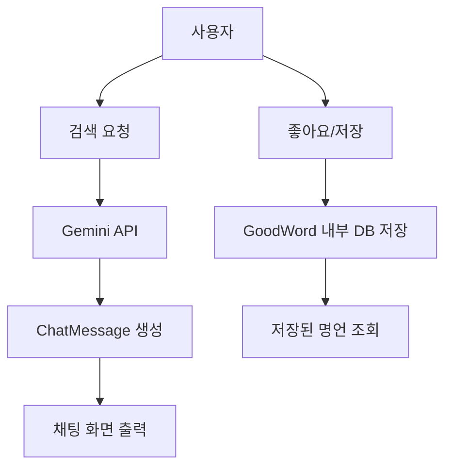

# 좋은 생각 카드
<p align="left">


</p>
채팅 기능을 구현해보고 싶어 시작한 Android-Kotlin 개인 프로젝트입니다.
Gemini API를 활용해 명언 생성과 대화형 챗봇 기능을 구현하였습니다.

## 📖 프로젝트 소개
좋은 생각 카드는 Gemini API를 활용한 명언 저장 및 챗봇 서비스입니다.
- 프롬프트 기반 명언 생성
  - 단순 프롬프트 입력으로 명언을 요청할 수 있습니다.
  - 반환된 명언은 저장 / 수정 / 삭제 (CRUD) 기능을 지원합니다.
  - 저장된 명언은 랜덤 카드 뽑기 형식으로 불러올 수 있습니다.
- 대화형 챗봇
  - 모바일 환경에 친숙한 채팅 UI로 구현하였습니다.
  - Gemini API를 통해 다양한 격려 메시지를 받을 수 있습니다.

## 🛠 기술 스택
|Category|Technology|
|--------|----------|
|Language|Kotlin|
|UI Framework|Jetpack Compose (Material3)|
|Architecture|MVI(Model-View-Intent)|
|DI|Hilt|
|Async|Coroutines, StateFlow, SharedFlow|
|AI Model|Google Gemini API (Generative AI)|
|Local DB|Room Database|
|Testing|JUnit4, Compose UI Test|
Language : Kotlin <br>

## ✨ 주요 기능
### 1. AI 챗봇 & 프롬프트 기반 명언 생성
- 대화형 인터페이스: 실제 메신저와 유사한 UI로 Gemini와 자연스러운 대화가 가능합니다.
- 맞춤형 생성: 사용자가 상황이나 감정을 입력하면, AI가 그에 맞는 격려 메시지와 명언을 생성합니다.

###2. 명언 카드 관리 (Archiving)
- CRUD 기능: 생성된 메시지 중 마음에 드는 내용은 로컬 DB(Room)에 저장, 수정, 삭제할 수 있습니다.
- 좋아요/북마크: 채팅 흐름 속에서 즉시 데이터를 저장하는 직관적인 UX를 제공합니다.

### 3. 랜덤 카드 뽑기 (Gamification)
- 랜덤 조회: 저장된 명언 데이터를 활용하여 하루의 운세처럼 무작위 카드를 뽑아보는 기능을 제공합니다.

## 🏞️ 화면
<p align="center">
  
  
  
  
</p>

## 📊 플로우 차트
- Gemini API를 통해 명언을 검색하거나 대화형 챗봇 서비스를 이용
- 생성된 명언(또는 사용자가 작성한 명언)을 Room DB에 저장
- 저장된 데이터는 CRUD 및 랜덤 카드 뽑기 기능으로 활용



## 📂 프로젝트 구조
```Markdown
good-thinking/
    ├── data/
    │   ├── local/              # Room DAO, Entity
    │   ├── remote/             # Gemini API Service
    │   └── repository/         # Repository Implementations
    ├── domain/                 # UseCases, Models, Repository Interfaces
    ├── di/                     # Hilt Modules (Network, Database)
    ├── presentation/
    │   ├── chat/               # 채팅 화면 및 ViewModel
    │   ├── archive/            # 명언 보관함 화면
    │   ├── card/               # 랜덤 카드 뽑기 화면
    │   └── components/         # 공통 UI 컴포넌트 (ChatBubble, CardView 등)
    └── ui/theme/               # 테마 및 컬러 설정
```

## 👀 개발 과정에서 발생한 이슈
### 1. Compose UI 테스트 환경 구축
- 문제: 초기에는 비즈니스 로직 검증을 위해 JUnit4 기반의 단위 테스트(Unit Test)를 시도했으나, UI 상태(StateFlow) 변화와 화면 렌더링 검증에 한계를 느꼈습니다.
- 해결: Compose UI Test(composeTestRule)를 도입했습니다.
  - Mock Repository를 주입하여 실제 DB나 네트워크 연결 없이도 테스트가 가능하도록 격리했습니다.
  - onodeWithText, performClick 등의 API를 활용하여 사용자의 채팅 입력부터 메시지 출력, 저장 버튼 클릭까지의 시나리오 테스트(Instrumentation Test)를 성공적으로 구현했습니다.

### 2. Gemini API 응답 지연 처리
- 문제: AI 모델 특성상 응답 생성에 시간이 소요되어 UI가 멈춘 것처럼 보이는 현상이 발생했습니다.
- 해결: Loading 상태를 정의하고, AI가 응답을 생성하는 동안 채팅창에 '작성 중...' 애니메이션(Typing Indicator)을 노출하여 사용자 경험(UX)을 개선했습니다.

## 🎯 개발 계획
- 에러 처리 고도화: 네트워크 불안정 혹은 API 토큰 만료 시 사용자에게 명확한 피드백(Snackbar, Dialog) 제공.
- 테스트 커버리지 확대: 현재의 Happy Path 외에 예외 상황(Edge Case)에 대한 테스트 코드 추가 작성.
- 카테고리 분류: 저장된 명언을 감정별/주제별 태그로 분류하는 기능 추가.
