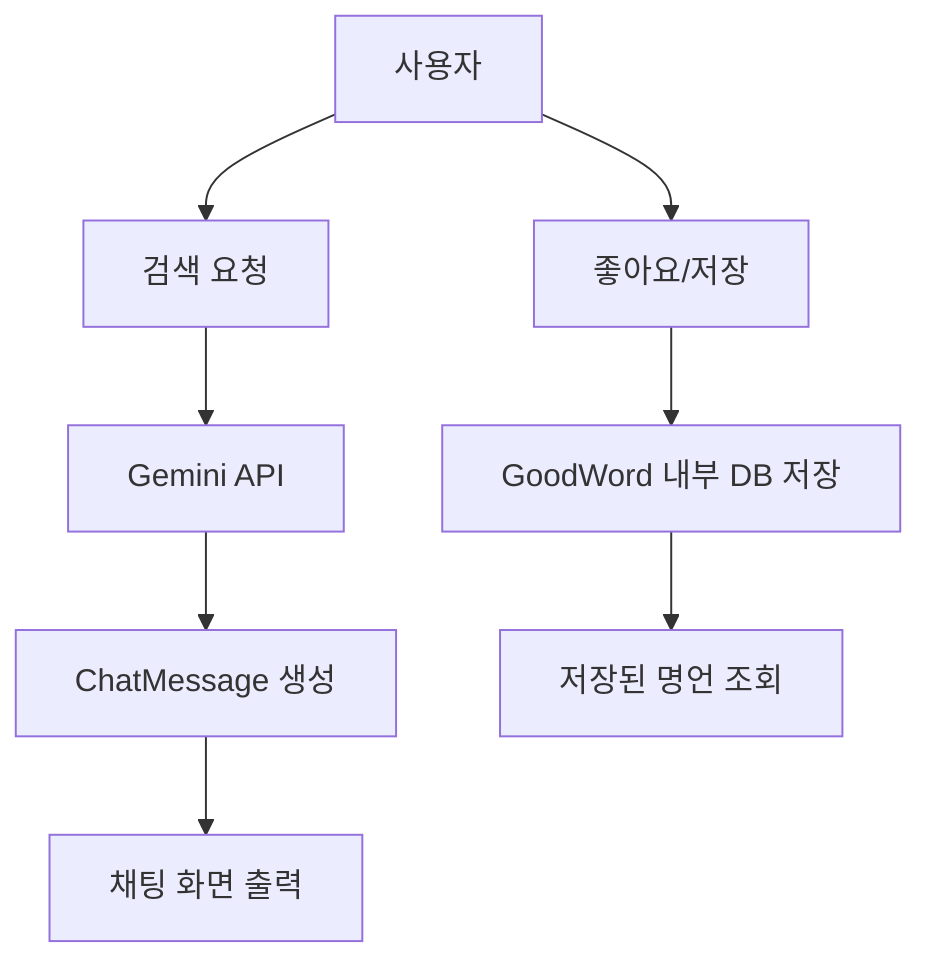

# 좋은 생각 카드
채팅 기능을 구현해보고 싶어 시작한 Android-Kotlin 개인 프로젝트입니다.
Gemini API를 활용해 명언 생성과 대화형 챗봇 기능을 구현하였습니다.

## 📖 프로젝트 소개
좋은 생각 카드는 Gemini API를 활용한 명언 저장 및 챗봇 서비스입니다.
- 프롬프트 기반 명언 생성
  - 단순 프롬프트 입력으로 명언을 요청할 수 있습니다.
  - 반환된 명언은 저장 / 수정 / 삭제 (CRUD) 기능을 지원합니다.
  - 저장된 명언은 랜덤 카드 뽑기 형식으로 불러올 수 있습니다.
- 대화형 챗봇
  - 모바일 환경에 친숙한 채팅 UI로 구현하였습니다.
  - Gemini API를 통해 다양한 격려 메시지를 받을 수 있습니다.

## 🛠 기술 스택
Language : Kotlin  
View : Compose  
AndroidX : Room, ViewModel, Hilt, AndroidX-Flow-Lifecycle  
Kotlin : Coroutine, StateFlow  
상태 관리 : StateFlow, ViewModel  
etc : Gemini API, JUnit4  

## ✨ 주요 기능
- 명언 관리 (CRUD) : Firebase + Room DB를 활용한 데이터 관리
- 랜덤 카드 뽑기 : 저장된 명언 중 무작위 제공
- 챗봇 기능 : Gemini API 기반 대화형 인터페이스
- 테스트 코드 작성 : JUnit4 + Compose UI Test 활용

## 🏞️ 화면

  
  
  
  

## 📊 플로우 차트
- Gemini API를 통해 명언을 검색하거나 대화형 챗봇 서비스를 이용
- 생성된 명언(또는 사용자가 작성한 명언)을 Room DB에 저장
- 저장된 데이터는 CRUD 및 랜덤 카드 뽑기 기능으로 활용

## 👀 개발 과정에서 발생한 이슈

### 1. 테스트 코드 작성
- 초기에는 JUnit4를 활용했으나 환경 문제로 실행 단계에서 오류가 발생
- 이후 Compose UI Test를 도입하여 기본 UI 동작 검증에 성공
- Mock 데이터를 활용해 CRUD 기능까지 검증 가능하게 확장
- 시행착오를 거쳐 UI + 기능 단위 테스트 환경을 구축

## 🎯 개발 계획
- 챗봇 기능 에러 처리 고도화
- 테스트 코드 범위 확장
